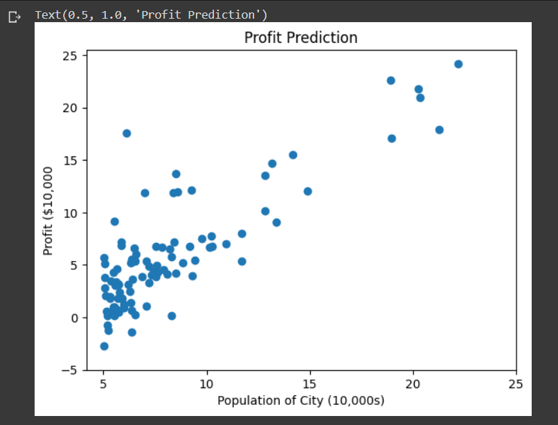
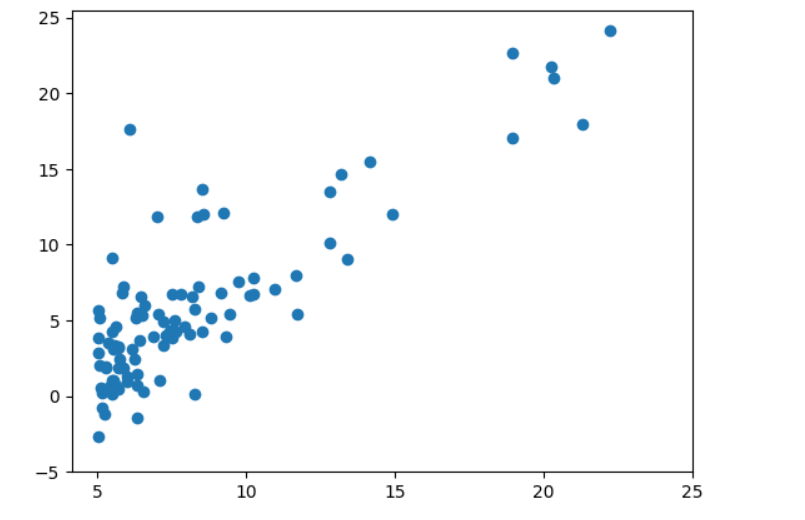
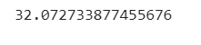
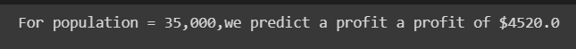
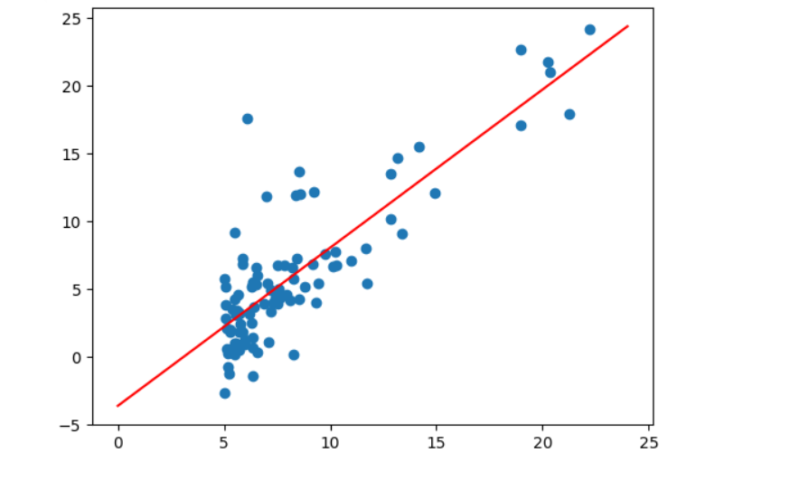
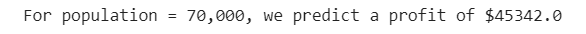

# Implementation-of-Linear-Regression-Using-Gradient-Descent

## AIM:
To write a program to predict the profit of a city using the linear regression model with gradient descent.

## Equipments Required:
1. Hardware – PCs
2. Anaconda – Python 3.7 Installation / Jupyter notebook

## Algorithm
1. 
2. 
3. 
4. 

## Program:
```
/*
Program to implement the linear regression using gradient descent.
Developed by: MADHAN BABU P
RegisterNumber:212222230075  
*/

import numpy as np
import pandas as pd
data = pd.read_csv("/content/ex1.txt",header=None)
print(data)

plt.scatter(data[0],data[1])
plt.xticks(np.arange(5,30,step=5))
plt.yticks(np.arange(-5,30,step=5))
plt.xlable1("Population of city(100000)")
plt.ylable1("profit(10000")
print(plt.title("Profit Prediction"))

def ComputeCost(X,y,theta):
    m=len(y)
    h=X.dot(theta)
    square_err=(h - y)**2
    return 1/(2*m) * np.sum(square_err)

data_n=data.values
m=data_n[:,0].size
X=np.append(np.ones((m,1)),data_n[:,0].reshape(m,1),axis=1)
y=data_n[:,1].reshape(m,1)
theta=np.zeros((2,1))
ComputeCost(X,y,theta)

def gradientDecent(X,y,theta,alpha,num_iters):
   m=len(y)
   J_history=[]

   for i in range(num_iters):
     predictions =X.dot(theta)
     error=np.dot(X.transpose(),(predictions -y))
     descent=alpha * 1/m *error
     theta-=descent
     J_history.append(ComputeCost(X,y,theta))
   return theta,J_history

plt.plot(J_history)
plt.xlabel("Iteration")
plt.ylable("$J(\Theta)$")
plt.title("Cost function using Gradient Descent")

plt.scatter(data[0],data[1])
x_value=[x for x in range(25)]
y_value=[y*theta[1]+theta[0] for y in x_value]
plt.plot(x_value,y_value,color="r")
plt.xtricks(np.arange(5,30,step=5))
plt.ytricks(np.arange(-5,30,step=5))
plt.x_lable("population of city (10,000s)")
plt.y_lable("Profit ($10,000")
plt.title("Profit Predictions")

def predict(x,theta):
  predictions = np.dot(theta.transpose(),x)
  return  predictions[0]

predict1=predict(np.array([1,3.5]),theta)*10000
print("For population = 35,000, we predict a profit of $"+str(round(predict1,0)))

predict2=predict(np.array([1,7]),theta)*10000
print("For population = 70,000, we predict a profit of $"+str(round(predict2,0)))


```

## Output:









## Result:
Thus the program to implement the linear regression using gradient descent is written and verified using python programming.
